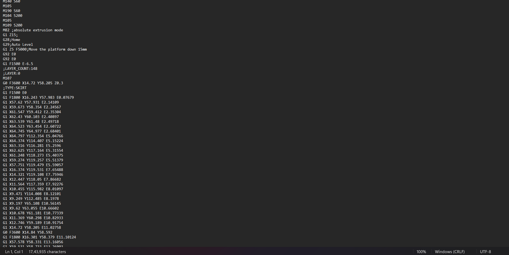
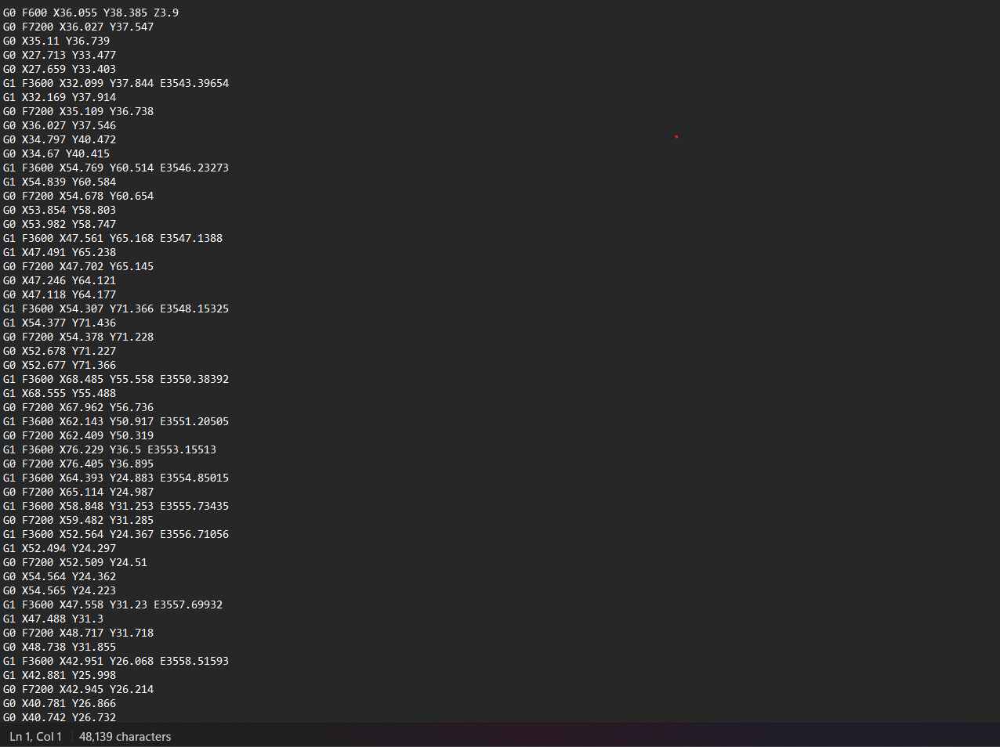
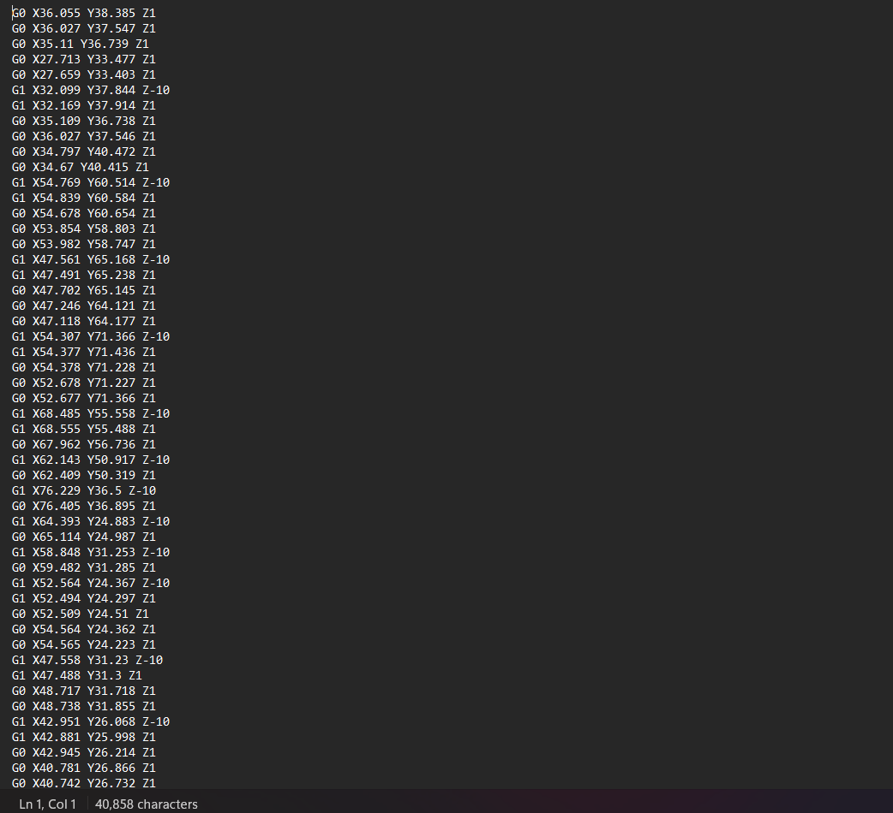

# CNC Cutting Project

## Introduction

This project provides a solution for CNC cutting by converting G-code generated from an STL file for 3D printing. The `cnccut.py` Python script takes input for the layer you want to cut and the dimensions of the slab you want to cut by CNC. It then converts the input G-code to output G-code and makes appropriate changes for CNC cutting, resulting in the final G-code for CNC cutting.

## Tools Used

- Python
- STL file (3D model)
- CNC machine
- G-code

## Repository Structure

- `cnccut.py`: Python script for CNC cutting
- `input.gcode`: Input G-code generated from an STL file
- `output.gcode`: Output G-code after initial conversion
- `output1.gcode`: Final G-code for CNC cutting
- `output.png`: Image representing the initial conversion result
- `output1.png`: Image representing the final CNC cutting G-code

## How to Use

1. **Generate Initial G-code**: Use your preferred tool to generate G-code from an STL file for 3D printing. Save it as `input.gcode`.

2. **Run `cnccut.py` Script**: Execute the `cnccut.py` script, providing the layer to cut and the dimensions of the slab. This script will generate an intermediate G-code file named `output.gcode`.

    ```bash
    python cnccut.py 
    ```

3. **Convert to CNC Cutting G-code**: The script will make appropriate changes for CNC cutting, and the final G-code will be saved as `output1.gcode`.


4. **Check Output Images**: Sample output can be seen checking the images `output.png` and `output1.png` representing the initial conversion and final CNC cutting G-code.

## Example

```bash
python cnccut.py 5
